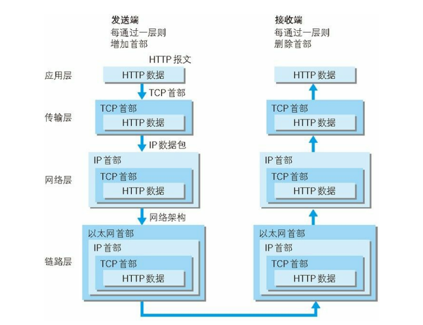
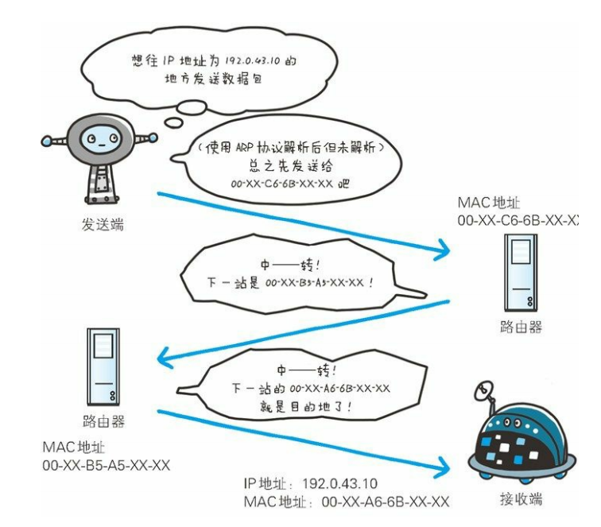
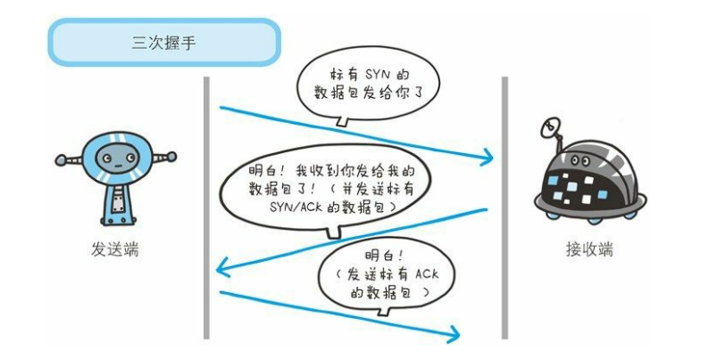
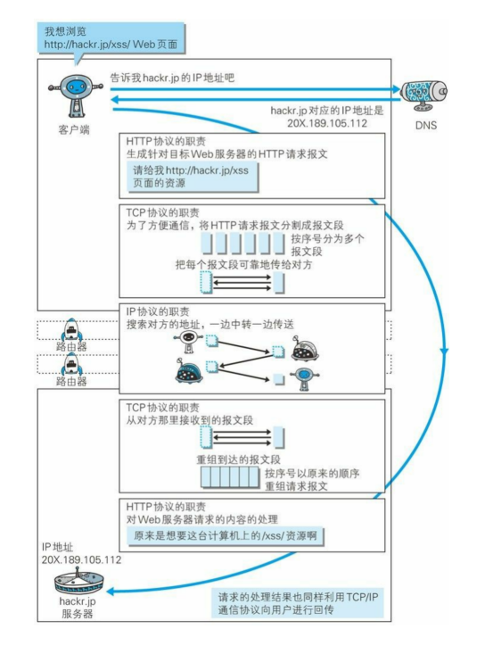
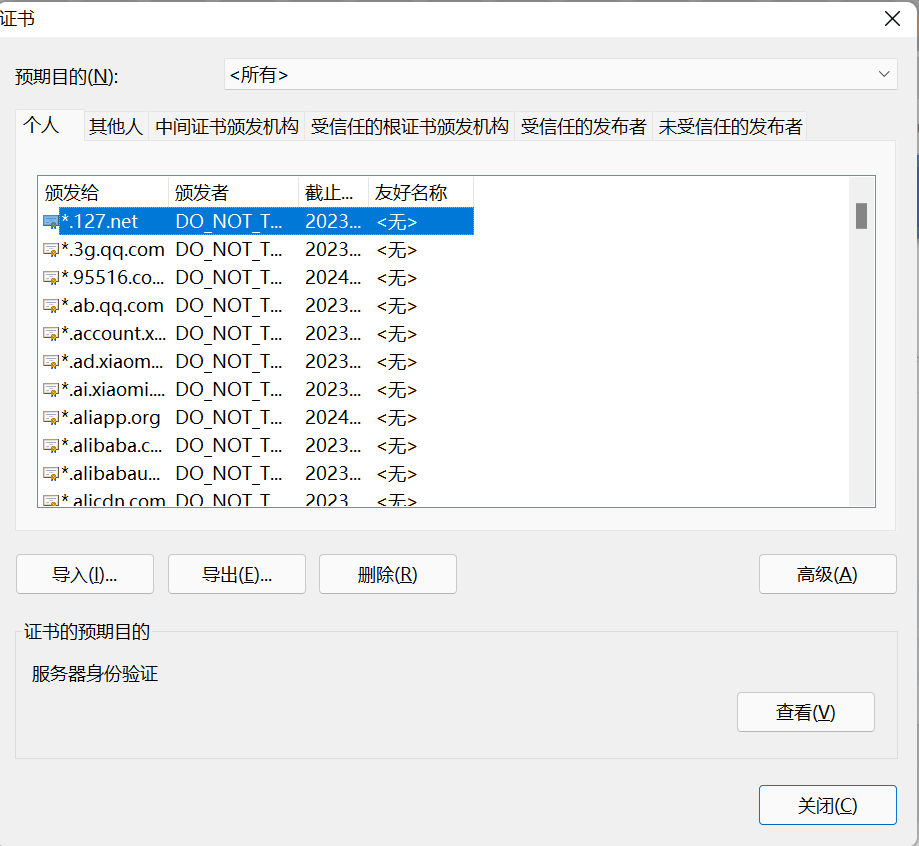

#### TCP/IP协议簇按协议划分

应用层，传输层，网络层，数据链路层

#### TCP/IP协议簇内容

分层的好处：每层只关心自己的事情，有变动的只需替换变动的层即可

- 应用层：应用层决定了向用户提供应用服务时通信的活动。
  - FTP
  - DNS：域名到 IP 地址之间的解析服务。
  - HTTP：生成目标web服务器的请求报文。
- 传输层：提供处于网络连接中的两台计算机之间的数据传输。
  - TCP([详解](#tcp))，UDP
- 网络层：处理网络上流动的数据包，将数据包发送到指定计算机。
  - IP 协议，[详解](#ip)
- 数据链路层：用来处理连接网络的硬件部分。

<h4 id="ip">IP协议</h2>

IP 协议的作用是把各种数据包传送给对方。而要保证确实传送到对方那里，则需要满足各类条件。其中两个重要的条件是：

- IP 地址
- MAC 地址（Media Access Control Address）：网卡所属的固定地址。

<h4 id="tcp">TCP</h4>

1. 为了更容易传送大数据,把数据分割成一个个数据包。
2. 确保数据最终送达给对方 -- 三次握手。

#### DNS，IP协议 与http协议关系

#### https的原理

https的原理要从怎么解决安全性问题来一步步阐明，这样说起来会更清晰一点：

1. 如何解决网络传播中数据安全问题？

答：运用对称加密或者非对称加密来加密数据内容。https 使用`对称加密`加密数据内容，不使用`非对称加密`是因为性能比`对称加密`更差。

2. `对称加密`的密钥需要双方都要知道，如何保证密钥安全？

答：使用`非对称加密`加密`对称加密`的密钥。客户端拥有`非对称加密`的公钥，对`对称加密`的密钥加密后，传给服务端，服务端用`非对称加密`的私钥解密，拿到明文的`对称加密`的密钥，确保`对称加密`的密钥在网络传输中不被劫持破解。

3. 客户端从哪拿到`非对称加密`的公钥？并且怎么确保这个公钥是服务器下发的，而不是攻击人中途替换的？

答：服务端生成一对`非对称加密`的公私钥，公钥会给客户端。至于这个公钥的权威性如何保证依赖CA认证。服务器把公钥给CA去认证，CA在确认这个申请人的身份后，会对公钥做数字签名（CA自己的私钥加密），然后这个 `数字签名+明文公钥`
会一并给服务端，服务端再给客户端，客户端拿CA机构的公钥去对这个数字签名进行验证（公钥验签），没问题的话就说明服务器下发的公钥是没有掉包的，值得信赖的。

4. 客户端哪来的CA机构的公钥？

答：游览器会直接内置常用CA机构的公钥。所以至此我们也能理解抓包软件的原理，在我们使用抓包软件的时候，通常需要先导入并信任抓包软件提供的证书，这样抓包软件可以伪装成为CA，客户端实际就成了在与抓包软件进行https通讯（自然也就可以解密客户端传的明文信息）；然后抓包软件又与服务端进行通信，把自己伪装成客户端（自然也就可以解密服务端传的明文信息）。抓包软件能够顺利成功实施中间人攻击的关键就是用户主动内置并信任抓包软件的证书。

#### 声明

- 本章总结了《图解 HTTP》的内容，想系统学习可以直接阅读本书。

